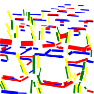
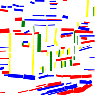
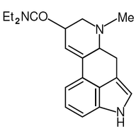
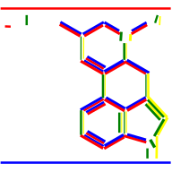
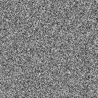

# @votingworks/lsd

NodeJS bindings for
[LSD: a Line Segment Detector](http://www.ipol.im/pub/art/2012/gjmr-lsd/)
[v1.6](http://www.ipol.im/pub/art/2012/gjmr-lsd/lsd_1.6.zip). From the original
article:

> LSD is a linear-time Line Segment Detector giving subpixel accurate results.
> It is designed to work on any digital image without parameter tuning. It
> controls its own number of false detections: On average, one false alarms is
> allowed per image. The method is based on Burns, Hanson, and Riseman's method,
> and uses an a-contrario validation approach according to Desolneux, Moisan,
> and Morel's theory. The version described here includes some further
> improvement over the one described in the original article.

# Examples

| Input                            | Output                               |
| -------------------------------- | ------------------------------------ |
|      |      |
|  |  |
|  |  |
|        |        |

# Install

This package is private and is not intended to be published to NPM, but is for
use within the `vxsuite` monorepo. To use it from a library or app within the
monorepo, run `pnpm i -S '@votingworks/lsd@workspace:*'` in the library/app
root.

# Library Usage

```ts
import lsd from 'lsd'

// get a 1-channel grayscale `ImageData` object somehow
const gray = await readGrayscaleImage(path)

// get line segments
const segments = lsd(gray)

console.log(segments)
// [{ x1: 63.59566, x2: 63.59566, y1: 0.625, y2: 126.875, width: 1.25 }, …]
```

# CLI Usage

This package includes a CLI for quick testing of images:

```sh
$ pnpx lsd path/to/image.png
📝 path/to/image-lsd.svg
```

Open the SVG file in an SVG viewer (e.g. Chrome) to view it.

# Credits

The actual algorithm uses the C++ code found in `lsd.cpp` and `lsd.h`
[published by Rafael Grompone von Gioi, Jérémie Jakubowicz, Jean-Michel Morel, and Gregory Randall in their paper](http://www.ipol.im/pub/art/2012/gjmr-lsd/).
The NodeJS C++ addon and accompanying JavaScript code is written by VotingWorks.

# License

AGPL-3.0
